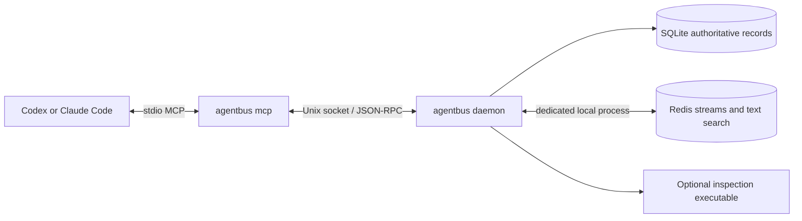

# Agentbus local design

Status: consolidated design for final review. Behavioral and configuration
decisions have been approved in discussion; implementation has not begun.

## Purpose and scope

Agentbus lets coding agents belonging to one OS user on one macOS or Linux
machine exchange channel messages and maintain mutable shared memories. Persistent
names make participants recognizable; native harness conversation IDs determine
session continuity. SQLite is authoritative, Redis is disposable, and operational
continuity takes precedence over retaining ordinary messages indefinitely.

The [decision record](../../adr/0001-discussion-decisions.md) labels the human-made
architectural decisions. The user also approved the complete
[configuration specification](../../configuration-proposal.md), including every
default, bound, fixed limit, and accounting rule. Both are normative inputs to
this design. Concrete data structures and sequencing below implement those
decisions and are included for final design review.

No cross-machine transport, cross-user authentication/authorization, native
Windows runtime, semantic search, human monitoring UI, channel-type conversion,
or separate cross-session cursor-copy API is included initially. Windows paths
remain valid reference values. Semantic search is explicitly future scope.

## Components and ownership

One Go executable provides `mcp`, `daemon`, `status`, `stop`, and `reset`.

- **Adapter:** stdio MCP lifecycle, registration, bounded background prefetch,
  translating agent calls, reporting successful response handoff, and presenting
  errors and transient broadcasts. It does not write SQLite or talk directly to
  Redis.
- **Daemon:** one owner of registration, validation, inspection, rate limits,
  mutations, ordering, cursors, Redis projection/recovery, and cleanup.
- **Redis:** a dedicated local process launched/configured by the daemon using a
  user-installed compatible executable. It stores eligible active message streams
  and current memory search data, with no independent arbitrary-key eviction.
- **SQLite:** messages/revisions, channel and identity metadata, subscriptions,
  durable cursors, compact dedup receipts, and retention boundaries.
- **Inspection application:** optional executable accepting a bounded JSON input
  and returning a bounded allow/deny result. It cannot rewrite messages.

Use a persistent Unix stream connection per adapter. Internal frames are one
JSON-RPC 2.0 object per line. The 8 MiB frame limit is enforced before accumulating
unbounded input. Bound outgoing queues too; blocked prefetch must not block
heartbeats, operation responses, or acknowledgment processing.

## Identity and harness lifecycle

A bus agent has a stable internal ID and a friendly persistent name selected by
the integration through `--agent`. SQLite creates/looks up that binding.
Repository identity/context supplies a human-readable hint, not the primary key.

A main session is identified by application plus native resumable conversation
ID. A child additionally supplies its native child ID and parent binding. Never
guess identity from transcript paths, display names, PIDs, or repository alone.
Codex/Claude integration must supply lifecycle changes explicitly; access to an
ID in a shell does not establish that an MCP server automatically receives it.

| Transition | Bus behavior |
|---|---|
| Fresh conversation or `/clear` | Register new native conversation; new subscriptions start at current channel positions |
| Resume native conversation or reconnect | Register same identity; restore retained unexpired subscriptions/cursors |
| Duplicate live attachment | Reject newcomer with `session_already_connected`; preserve first attachment |
| Unsubscribe | Delete that subscription/cursor; resubscribe starts at current position |
| Cursor expired | Return explicit `cursor_expired`; do not silently start from now |
| Retention gap | Report the gap and continue automatically from oldest retained message |

Attachment ownership is separate from durable session state. Heartbeats run
every 10 seconds; disconnect or 30 seconds without liveness releases ownership.
Bind operations to the current connection and a daemon-issued attachment generation
so a stale owner cannot acknowledge or mutate after replacement.

Display names are allocated across applications within each persistent identity:
Sam, Sam2, Sam3. Keep an active attachment's name when others exit. Released names
are reusable; after all Sams leave, a fresh session gets Sam. On resume, reuse the
old display name if free, otherwise choose an available suffix. Historical
messages retain the display name at their creation and the stable IDs. Children
derive names from the parent's current display name and role/task suffix, such as
`Sam2-implement804 (tmi)`.

Directory discovery is configurable; disabling it does not hide message senders.

## Agent operations and result contracts

The operation names below describe contracts; exact exported MCP tool names may
follow the chosen SDK's naming conventions without changing these semantics.

| Operation | Input and behavior |
|---|---|
| Create channel | Name and immutable ordinary/memory kind; idempotent when settings match; conflicting kind is an error |
| Subscribe | Existing channel; retain a session-specific subscription and cursor |
| Unsubscribe | Channel; discard its session cursor |
| Send | Existing channel, stable message/operation ID, content, type, reply linkage, metadata, structured references |
| Receive | Subscribed channels, count and wait limit; messages, transient notices, explicit gaps/expiry information |
| Search | Text plus optional channel, sender, time and thread/reply filters; bounded results and continuation token |
| Get memory | Stable memory ID; current live revision or not-found |
| Edit memory | Stable memory ID, unique operation ID, replacement content/envelope fields; last committed write wins |
| Delete memory | Stable memory ID and unique operation ID; tombstone current revision and notify connected subscribers |
| Discover | Current directory information when discovery is enabled |

Registration, heartbeats, prefetch flow control, and handoff acknowledgments are
adapter/daemon operations, not tasks the language model must perform manually.

All results fit the 4 MiB serialized result budget and contain whole records.
Counts are maxima, not requests to wait for a full batch. Search pages default to
100 records with an upper bound of 1000; pagination must tolerate concurrent
mutation without promising snapshot isolation across pages. Search initially
matches text and structured filters; there is no embedding pipeline.

Tool failures carry an application error code, readable message, optional reason,
and retryability. The MCP adapter exposes them as failed tool results. Internal
JSON-RPC errors retain numeric protocol codes; application codes such as
`inspection_rejected` are structured application data, not JSON-RPC numeric codes.
Distinguish validation, not-found, conflicting ID reuse, rate limits, unavailable
service, duplicate attachment, configuration mismatch, and cursor expiry.

An explicit inspection denial returns `inspection_rejected` and the hook's reason
in the original send/mutation response. A timeout, crash, malformed output, or
output overflow returns `inspection_unavailable`. No separate rejection unicast
or recv call is required. Never automatically retry unchanged denied content.

## Envelope and storage

The common envelope includes stable message ID, channel, bound sender agent and
application/session/child identity, display name at send time, repository context,
server timestamp, content, message type, optional reply/thread linkage, optional
key/value metadata, and structured references. Reference entries contain `kind`
and `value`; kinds cover URL, Unix path, and Windows path. Preserve reference
values through JSON encoding without dereferencing them or extracting references
from message text. Enforce the complete-envelope size limit.

The daemon binds sender fields from the attachment and assigns authoritative
ordering/timestamps. Last-write-wins refers to committed daemon order, never
client clock order. Ordinary messages preserve per-channel delivery order; no
cross-channel order is promised. A single increasing durable sequence can order
commits globally while per-channel cursors select messages from that sequence.

| SQLite records | Key information and constraints |
|---|---|
| Agents | Stable agent ID, unique persistent name |
| Sessions | Agent binding, application/native conversation/child IDs, display history/context; native binding uniqueness |
| Channels | Unique name, immutable kind, creation position, retained/evicted boundaries |
| Subscriptions | Session + channel key, durable delivered position, last explicit activity and expiry |
| Messages | Stable message/memory ID + revision key, sequence, channel, complete envelope/content, tombstone boolean/time |
| Operation receipts | Operation ID, bound sender, canonical submitted-payload fingerprint, accepted result identifiers, expiry |

Index channel/sequence, live memory lookup, tombstone time, cursor expiry, receipt
expiry, and ordinary-message age/sequence cleanup. There is one message record per
revision, not a second table copying message content into events or tombstones.
Receipt hashes exclude daemon-generated timestamps/positions and remain stable
across equivalent JSON object key ordering.

## Send and mutation flow

1. Require ready state and a current attachment; reject unavailable/recovering
   operations even when the operation may be a retry.
2. Validate bounded input, bind sender, and check a durable receipt. Matching ID,
   sender, and submitted payload returns original acceptance without another
   message/revision, inspection, or accepted-mutation rate charge. Conflicting
   reuse is rejected.
3. For a new mutation, enforce both count and byte rate limits and invoke the hook.
   No hook means allow. Hook work must not block the daemon's heartbeat/control
   loop. Recheck attachment and readiness before committing if they changed while
   inspection was running.
4. Serialize the state change, channel position, receipt, and accounting updates
   in SQLite. Concurrent matching requests recheck dedup inside this boundary.
5. Apply the committed change to Redis. SQLite commit is the acceptance boundary;
   delivery/search visibility follows projection. Success never precedes commit.
   A lost response leaves the caller uncertain; retry with the same operation ID.
6. If projection is uncertain, recover rather than inventing a second durable
   replay log. A transaction committed just before failure remains recoverable;
   new operations during recovery are rejected.

Receipts live 72 hours by default from first acceptance, independently of message
retention. A retry may report original acceptance after the original content was
pruned. After receipt expiry there is no dedup guarantee; automatic retries stop
after 30 seconds. A request must reuse its operation ID for every automatic retry.

## Mutable memories

Creating a memory writes its initial revision. Revising memory 123 performs one
transaction: set rev1's `tombstone` boolean to true and record its tombstone time,
then insert rev2 with replacement content and `tombstone=false`. Keep rev1's full
message content until purge. A deletion tombstones the current revision without
inserting a replacement. Edit of a deleted memory returns not-found; recreation
uses a new memory ID. Concurrent edits serialize, so the last committed edit wins;
there is no expected-revision check. A retried edit reuses its operation receipt
and does not manufacture another revision.

Normal search/get operations expose only the current live revision. Memory
changes can broadcast the stable ID, new revision and content, or deletion notice,
to connected subscribers without persistence. These notices have no durable
cursor obligation and no replay guarantee. The initial memory send follows the
ordinary subscription entry flow, but an obsolete or deleted revision must not
be served as current content merely because it remains physically in SQLite.
Adapters invalidate affected prefetched memory content before a later receive;
content already handed off cannot be recalled. Reconnecting consumers can query
the authoritative current memory state.

Tombstones are existing message rows, retained at least 72 hours. Do not purge
while pending projection/recovery could reintroduce their content. Non-persisted
change notices never pin tombstones behind offline cursors. Old revisions are
purged under this rule; no separate perpetual memory audit/event log is added.

## Receiving and acknowledgment

The background receiver runs independently of recv. Default per-adapter bounds
are 256 queued messages and 4 MiB serialized bytes. Stop requesting/issuing
prefetch when either fills; do not build an unbounded queue in the daemon instead.
Maintain separate ability to process control traffic.

Recv defaults to 100 records and zero wait. It returns available whole records
within count/byte limits, waiting only when empty. On retention loss, include an
explicit affected-channel boundary/gap and resume at the oldest surviving
position. If none remain, record the observed retained boundary so later messages
can continue. A gap is not proof that an unavailable message was delivered.

Only successful MCP response handoff permits a delivered-position report. For
each channel, advance over handed-off messages and explicitly reported removed
positions, never over merely prefetched messages. The daemon commits reports
after 20 ms or 100 pending handoff reports, whichever comes first, and during
orderly shutdown. Acknowledge the report only after commit. A crash before that
commit may redeliver. Unsubscribe and recovery invalidate stale reports so they
cannot move replacement subscriptions or a new attachment's cursor.

The 72-hour cursor inactivity clock is renewed only by explicit subscription use
(recv, including empty receives, or explicit resume/renew), not heartbeats,
prefetch, acknowledgments, or unrelated agent activity. Expiry is distinct from
retention gaps and requires an explicit result rather than silent recreation.

Transient broadcasts use bounded queues and may drop for slow or disconnected
consumers. They never advance ordinary delivery cursors.

## Recovery, cleanup, and accounting

Startup and uncertain synchronization enter recovering state. Status and control
remain usable; sends/mutations/receive/search report unavailable. Invalidate
prefetch and reports from the old recovery generation. Rebuild only the dedicated
Redis instance from authoritative current SQLite state, with writes serialized
against cleanup/rebuild so stale content cannot be replayed after deletion.

Restore current live memories and eligible retained ordinary messages, including
backlogs of unexpired subscriptions. Retained ordinary rows are also the active
text-search history. Apply approved retention/capacity cleanup during rebuild if
needed, preserving its explicit gap boundaries. Never promise to restore history
already removed by cleanup. Become ready after streams, search, and subscription
state are consistent. Accept a full rebuild pause for the initial version.

Use global Redis and SQLite budgets, not channel quotas. Periodic cleanup runs
every 60 seconds and removes ordinary messages older than 168 hours. At capacity,
run that age cleanup immediately; if still full, delete ordinary messages globally
oldest-first until 25% is free in the constrained store(s). Eviction removes
corresponding history in both stores so Redis rebuilding cannot reverse eviction.
Unread cursors do not block ordinary cleanup. Tombstones and live memories follow
their separate rules.

Redis accounting includes dataset/index allocation, not process RSS. SQLite's
2048 MiB default budget is logical retained row data, including memory revisions,
tombstones, receipts and metadata, not a hard limit on file/index/WAL size.
Maintain accounting transactionally on insert/delete and recompute on startup
for verification. Reuse freed pages and perform normal bounded checkpoint/
reclamation work; do not repeatedly compact the whole database merely because
allocated file size exceeds live data.

If ordinary cleanup cannot free space, keep the daemon available and broadcast
the approved non-persisted capacity warning to every channel via live adapters.
Identify the exhausted budget and actual config path, with instructions to raise
capacity/restart or explicitly reset the database. Never automatically reset,
evict live memories, or report success for an uncommitted write. Do not add a
special reserved-capacity subsystem for this exceptional case.

## Process lifecycle and configuration

Use one per-user singleton lock and a filesystem Unix socket, independent of
config/data-directory selection. Only the lock owner creates/replaces stale
runtime endpoints and manages Redis. Losing startup contenders connect to the
winner. Identify dedicated Redis resources from the managed runtime state;
never stop or clear an unrelated Redis instance. Exact OS path and locking APIs
must be verified on both target platforms.

Adapter startup launches a daemon when needed. It remains online after sessions
exit. Unexpected loss may trigger bounded reconnection/startup; intentional stop
does not create a background restart loop. A subsequent explicit operation or
new adapter can start it. Orderly stop flushes within a 5-second grace period,
then closes connections and its Redis process. Reset requires confirmation,
invalidates active bindings, clears all bus data including identity/cursor state,
and preserves configuration. Generation changes prevent old attachments from
continuing against freshly reset state.

The [approved configuration](../../configuration-proposal.md) is the single
source of truth for all 22 configurable settings and fixed internal limits. Use
JSON at `~/.config/agentbus/config.json`, selected by optional `--config`; defaults
then file values, strict validation, no general environment overrides, and restart
to apply changes. Existing adapters reload before reattaching. Management commands
must remain usable to stop a daemon whose on-disk configuration has changed;
normal message operations report configuration mismatch until restart.

## Inspection and diagnostics

Execute configured argv directly, without a shell. Input contains operation kind,
validated payload and bound identity. Parse one bounded JSON decision with optional
reason. Enforce 5-second default timeout and 64 KiB stdout/stderr limits. No hook
means allow. Explicit denial and hook malfunction remain distinct errors returned
to the original caller. Log operation ID, sender and bounded reason, without the
rejected payload. Reasons may be shown to the agent but are data, not executable
instructions. Diagnostic logs rotate across four 16 MiB files.

Status exposes readiness, Redis health, effective config/accounting and connected
sessions. Debug diagnostics must not turn into a second persisted message log.

## Verification and implementation entry criteria

Use the approved real SQLite/Redis test scope, with temporary isolated data and a
dedicated test Redis instance. Small focused checks cover validation/serialization,
config bounds, ordering, receipt matching, and retention boundaries. Integration
tests must exercise actual transport/database behavior rather than mock away the
handoff, crash, and recovery conditions being verified.

Required acceptance scenarios include concurrent Sam sessions and duplicate
attachment; resume/clear/reconnect/expiry; FIFO gaps without manual cursor resets;
retry before/after receipt expiry; crashes before commit, after commit before
projection, and after handoff before acknowledgment persistence; obsolete memory
prefetch and tombstone purge; simultaneous startup and reset; slow receivers and
hook failures; and budget cleanup without ordinary-delivery guarantees blocking it.

Before implementation commits to library/adapter wiring, verify these concrete
integration contracts against selected versions:

1. Codex and Claude supply the correct conversation/child IDs to registration,
   refresh on clear/resume, and preserve identity on reconnect. Test in real harnesses.
2. The Go MCP transport exposes successful response handoff at the boundary this
   spec requires; no acknowledgment based solely on a tool handler returning.
3. The selected user-installed Redis exposes the required text-search/stream
   commands, and Go clients support the chosen local transport. Startup must probe
   capabilities and explain incompatibility.
4. SQLite driver/transaction behavior, row-byte accounting, checkpointing, and
   runtime-path/singleton handling work on macOS and Linux.

These checks have not been run during brainstorming. Their acceptance criteria
are specified here; they do not authorize silently changing architecture or
claiming an unverified integration works. Choose the smallest maintained Go
libraries that satisfy them, and record exact dependencies during implementation
planning. A failed capability check that requires a design change returns to the
user with the concrete trade-off.
